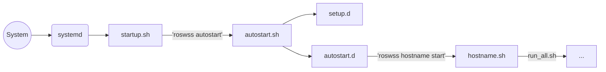

# ROS Workspace Scripts

The **ROS** **W**ork**s**pace **S**cripts (*roswss*) package provides an expandable framework for commonly used scripts in order to simplify your workflow in a ROS environment. The core features include:

 - Simple and expandable (shell) script management and usage
 - Many commonly used scripts
 - Autocomplete support using [programmable completion](https://www.gnu.org/software/bash/manual/bash.html#Programmable-Completion)
 - Modular workspace installation
 - Advanced remote computer / screen session management
 - Flexible configurable autostart 

## Setup

Clone the basic *roswss* package into your workspace. Afterwards, create a new catkin package (e.g. my_workspace_scripts) which should have following minimal structure:

```
|— my_workspace_scripts
    |— CMakeLists.txt
    |— package.xml
    |— 20.setup.bash.em
```

### CMakeLists.txt

A minimal CMake example setup looks like

```CMake
cmake_minimum_required(VERSION 2.8.3)
project(my_workspace_scripts)

find_package(catkin REQUIRED)
catkin_package()

catkin_add_env_hooks(20.setup SHELLS bash)

# install rules
install(DIRECTORY
    scripts
    DESTINATION ${CATKIN_PACKAGE_SHARE_DESTINATION}
    USE_SOURCE_PERMISSIONS
)
```

### package.xml

The manifest is as well very simple

```XML
<?xml version="1.0"?>
<package type="2">
  <name>my_workspace_scripts</name>
  <version>0.0.0</version>
  <description>The my_workspace_scripts package</description>

  <maintainer email="stumpf@sim.tu-darmstadt.de">Alexander Stumpf</maintainer>
  <license>BSD</license>
  <author email="stumpf@sim.tu-darmstadt.de">Alexander Stumpf</author>
  
  <buildtool_depend>catkin</buildtool_depend>
</package>
```

### 20.setup.bash.em

This file is originated from `20.setup_example.bash.em` of the workspace_scripts main folder. It must be copied into your scripts package and renamed into `20.setup.bash.em`. Open the file and provide all required data, especially the command prefix via `ROSWSS_PREFIX` (default: `roswss`) which is used to create a name alias for `roswss`. For details how to set `ROSWSS_ROOT_RELATIVE_PATH` and `ROSWSS_INSTALL_DIR` correctly, please read the **[Rosinstall](#rosinstall)** section.

**Note:** Each change of the `20.setup.bash.em` file requires a recompile and new terminal session in order to take full effect.

### Finalize Setup

After everything is setup, just run `catkin build` and open a new terminal. Everything should work as expected. You should be able to use your configured command prefix (or at least the default `roswss`) command. Please note that many commands support auto-completion and `--help` argument.

## Adding custom scripts

In order to add your own scripts, just add the `scripts` subfolder to your package. Any script placed in this folder can be directly used (no re-compile required).

```
|— my_workspace_scripts
    |— scripts
        |— my_script.sh
        |— ...
    |— CMakeLists.txt
    |— package.xml
    |— 20.setup.bash.em
```

**Note:** *roswss* will source a shell script if no execute permission is set. This allows scripts to change your current environment (e.g. exporting variables).

The script naming convention behaves like inheritance in object-oriented programming languages. Any own script will overload any previously defined script with the same name. The override order is indeed determined by alphabetical order of all environment hooks crawling for script files (usually the `xx.setup.bash.em`). The currently available scripts and their origin can be determined by using the `roswss --help`.

*roswss* does already provide a lot of convenient helper functions such as colored text outputs ([see helper.sh](https://github.com/tu-darmstadt-ros-pkg/workspace_scripts/blob/melodic-devel/scripts/helper/helper.sh)). In order to use them just source the `helper.sh` file:

```Shell
source $ROSWSS_BASE_SCRIPTS/helper/helper.sh
```

### Hooks

The update and make scripts do already provide the option for adding new routines while preserving the default behavior. For this purpose, the workspace overlay can provide a corresponding update and make scripts in the hook subfolder, which will be executed by the top-level script automatically.

```
|— my_workspace_scripts
    |— scripts
        |— hooks
            |— make_externals  # individual make scripts goes here (alphabetical calling order)
                |— projectX.sh    
                |— ...
            |— clean_externals # individual clean scripts goes here (alphabetical calling order)
                |— projectX.sh    
                |— ...
            |— make.sh         # additional (common) make routines go here
            |— update.sh       # additional (common) update routines go here
    |— CMakeLists.txt
    |— package.xml
    |— 20.setup.bash.em
```

## Autocomplete

The workspace scripts package supports [programmable completion](https://www.gnu.org/software/bash/manual/bash.html#Programmable-Completion). One can simply add own autocomplete scripts in addition to the provided default ones. All shell scripts located in the `scripts/completion` subfolder will be automatically sourced and added to your terminal environment.

```
|— my_workspace_scripts
    |— scripts
        |— my_script.sh
        |— ...
        |— completion
            |— my_super_script.sh
            |— ...
    |— CMakeLists.txt
    |— package.xml
    |— 20.setup.bash.em
```

The new autocomplete script must be registered using the `add_completion` function.

**Example:** Let us assume that within the newly created `my_super_script.sh` two functions named `my_script` and `_my_script_complete` have been defined. The former function implements a new awesome command while latter defines how the autocompletion arguments are formed based on [programmable completion](https://www.gnu.org/software/bash/manual/bash.html#Programmable-Completion). In order to register the new autocomplete functionality, add following line in your `20.setup.bash.em`:

```Shell
add_completion "my_script" "_my_script_complete"
```

After a quick recompile and starting a new terminal session the new command's autocompleting function should be recognized.
For details in working with [programmable completion](https://www.gnu.org/software/bash/manual/bash.html#Programmable-Completion) just take a look in the `completion` folder of *roswss* package.

## Python

The workspace scripts supports python scripts.
For an example, see the `scripts/analyze.py` script. Completion can be given using the `argcomplete` package (see `scripts/completion/analyze.sh`).

## Rosinstall

In large projects, the ROS workspace suffers from an excessive number of packages leading to long compile times. Therefore, *roswss* follows an approach to organizing your project workspace in "modules". Hereby, a simple rosinstall file and/or a shell script is used to define module's package composition and additional install routines. This approach enables to have only a basic workspace (including *roswss*) installed while additional modules can be added when required.

### Setup

The location of the install files must be provided in the  `20.setup.bash.em`:

```Shell
export ROSWSS_ROOT_RELATIVE_PATH="../.."
export ROSWSS_INSTALL_DIR="rosinstall"
```

The following example assumes the following ROS workspace layout. Any difference must be adapted respectively.

```
|— <ros_root>
    |— rosinstall
        |— my_default.rosinstall
        |— my_default.sh
        |— ...
        |— optional
            |— my_optional.rosinstall
            |— my_optional.sh
            |— ...
    |— src
        |— workspace_scripts
        |— ...
```

The `ROSWSS_ROOT_RELATIVE_PATH` specifies the **relative** path from the *roswss* package location to your ROS workspace root folder. Usually, packages are located in the `"<ros_root>/src"` directory why the default setting `"../.."` should be already correct in most cases.
The `ROSWSS_INSTALL_DIR` defines the **relative** path from your ROS workspace root folder `"<ros_root>"` to the location of all install files. In the given default settings, the complete path would compile to `"<ros_root>/rosinstall"`. All install files located in this folder will always be handled by default. All optional installable modules must be located in the `optional` subfolder.

### Usage

All files ending with `*.sh` and `*.rosinstall` located in the `optional` subfolder are considered as an optional installable module. All available modules can be listed with `roswss install --help`. Once a module (e.g. `my_optional`) was installed via `roswss install my_optional`, its changes will be tracked further on until it has been uninstalled by the corresponding `roswss uninstall my_optional` command. Therefore all used shell scripts must be written in an idempotent way that they can be (re-)installed although the module has been already installed. 

All *.rosinstall files should follow the [rosinstall file format](http://docs.ros.org/independent/api/rosinstall/html/rosinstall_file_format.html). Alternatively, a shell script can be used to handle more complex install routines such as installing deb packages and further dependencies. If both variants exist, the rosinstall file will be always handled before the shell script is executed.

Shell scripts are always called with a string argument which can either be "install", "update" or "uninstall" according to the invoking command. Furthermore, multiple helper functions are directly available (no sourcing required), which are defined in the [helper.sh](https://github.com/tu-darmstadt-ros-pkg/workspace_scripts/blob/melodic-devel/scripts/helper/helper.sh). Especially, the `depends` function let your install depend on other installs which will be executed before.

## Remote computer / Screen Management

Remote computers (or rather predefined screens) can be also managed by *roswss*. This feature enables to simply start and stop software on local as well as remote machines with short commands. Hereby, each started software runs in its own screen session why [*screen*](https://www.gnu.org/software/screen/screen.html) must be installed on each addressed machine.

Such a screen session can be defined by using the `add_remote_pc` function in the `20.setup.bash.em` file:

```Shell
add_remote_pc "<script_name>" "<host_name>" "<screen_name>" "<command>"
```
 - *script_name:* Unique name identifier of the screen session script used by *roswss*.
 - *host_name:* Hostname of machine on which the screen should run. "localhost" and IP addresses are valid inputs as well.
 - *screen_name:* Name of started screen
 - *command:* Command(s) to be executed within the screen.

After a quick recompile, following command can be used in a (newly opened) terminal:

```Shell
roswss <script_name> start/stop/show
```

**Tips:** Multiple screens can be defined for a single machine. In this way, the entire software stack can be easily managed on several screens. Hierarchical start of screens is also possible.

**Example:**
In `20.setup.bash.em` add

```Shell
add_remote_pc "my_script" "localhost" "my_screen" "echo 'hello world'; cat"
```
which will spawn a screen named "my_screen" with "hello world" output when calling

```Shell
roswss my_script start
```

## Autostart

Autostart is a very complex and difficult topic and comes with a lot of issues at different layers which have to be solved reliably. Hence, the currently known best-practice method using *roswss* is demonstrated next.

### Overview: Call Chain

The autostart procedure follows the call chain in the drawing below:



 1. The autostart procedure is triggered by the Linux OS via [systemd](https://www.freedesktop.org/wiki/Software/systemd/).
 2. The corresponding configured systemd service calls directly a `startup.sh` shell script.
 3. The `startup.sh` calls `roswss autostart`.
 4. The *roswss*'s internal `autostart.sh` script will call all scripts and launchfiles given in a predefined autostart package.

### Setup

Unfortunately, the autostart setup procedure is quite complex but provides great flexibility and scalability especially in multi-machine environments with complex software stacks. It takes heavy use of the presented features from *roswss* introduced above.

#### Step 1: Robot Bringup Package

It is recommended to create a dedicated catkin package collecting all bringup scripts and launchfiles. In order to use all *roswss* features best, the following package structure is recommended:

```
|— robot_bringup
    |— autostart.d # Automated software startup routines (optional)
        |— <hostname> # Machine-specific parts should be located in the correspondingly named subfolder (optional)
            |— Machine-specific scripts...
        |— common scripts...
    |— setup.d # Automated hardware/system setup routines (optional)
        |— <hostname> # Machine-specific parts should be located in the correspondingly named subfolder (optional)
            |— Machine-specific scripts...
        |— common scripts...
    |— scripts # Software startup routines
        |— helper scripts go here...
    |— startup.sh # Invoked by systemd service
    |— ...
```

**Notes:**
 - The placeholder `<hostname>` has to be replaced according to your setup.
 - All subfolders are optional.
 - The machine-specific routines will be only handled when the running machine's hostname is matching the subfolder's name.
 - A package example is provided [here](https://github.com/thor-mang/thor_mang_robot_bringup).

The presented package structure satisfies the *roswss*'s requirements for an autostart package. *roswss* must be notified which autostart package should be used by specifying the `AUTOSTART_LAUNCH_PKG` in the `20.setup.bash.em`, e.g.:

```Shell
export AUTOSTART_LAUNCH_PKG="robot_bringup"
```
Please keep in mind that this step requires a recompile.

#### Step 2: systemd Service

As the entry point for the autostart procedure, the systemd service must be generated. For this purpose, the file `robot_start.service` in `/etc/systemd/system` with following content must be created:
```
[Unit]
Description=My Startup Script

[Service]
Type=simple
User=<YOUR_USER>
ExecStart=<ABSOLUT_PATH_TO_YOUR_ROBOT_BRINGUP_PKG>/startup.sh
RemainAfterExit=yes

[Install]
WantedBy=multi-user.target
```
Replace `<...>` with your settings. An example can be found [here](https://github.com/thor-mang/system_mpc_ubuntu/blob/master/etc/systemd/system/thor.service).

In order to activate the service just call

```Shell
sudo systemctl enable robot_start.service
```

#### Step 3: Startup Shell Script

Now the `startup.sh` must be generated in the robot_bringup package as it is going to be invoked by the previously created systemd service.  It should contain the following content:

```Shell
#!/bin/bash
. <ros_root>/setup.bash
roswss autostart
```
where `<ros_root>` must be replaced by the **global** path to the ROS workspace root. An example is provided [here](https://github.com/thor-mang/thor_mang_robot_bringup/blob/master/startup.sh).

**Notes:**

 - The native **roswss** command prefix must be used here, as the user-selected prefix (alias) won't work at this point yet.
 - If the autostart feature should not be used, the `roswss autostart` can be replaced by any other instruction.


#### Step 4: roswss Autostart

Using the basic *roswss* autostart feature is now quite simple as long the in [step 1](#step-1-robot-bringup-package) declared autostart package has the structure as suggested for the robot_bringup package.  All shell scripts (\*.sh) located in the following folders are sequentially called using a **single bash session** in the given order:
 1. ../setup.d/
 2. ../setup.d/\<hostname>
 3. ../autostart.d/
 4. ../autostart.d/\<hostname>

**Please note:**
* Only files in the given folders are considered; The content of all their subfolders is intentionally ignored!
* All scripts are handled in alphabetical order.
* Scripts in `setup.d` will be sourced and therefore change the environment of the running bash session. Thus, it is the ideal place for exports of variables.
* Scripts in `autostart.d` require to have execute permission.

**Tips:**
* Enumerate scripts using following convention `XX.my_script.sh` (replace 'XX' by a decimal) in order to obtain a clearly defined execution order.
* A wait script such as given in [this example](https://github.com/thor-mang/thor_mang_robot_bringup/blob/master/autostart.d/motion/10.roscore.sh) should be placed to ensure the roscore has properly settled before proceeding. Analogously this should be done for any hardware that requires time to fully boot-up such as cameras.
* Scripts can also make use of the screen management feature described [above](#remote-computer--screen-management). This allows to stop and (re)start stacks of the automatically started software conveniently without rebooting the entire machine. A small example is provided [here](https://github.com/thor-mang/thor_mang_robot_bringup/blob/master/autostart.d/motion/20.robot_basics.sh). The next sections will include how to setup this feature.

#### Step 5: Multi-Screen Autostart

##### The run_all script

The previously described autostart feature by *roswss* works **sequential and has a blocking behvavior** as it waits for the termination of each started (sub)script. In order to run a collection of (non-terminating) scripts in **parallel** (each in a single screen session), the `run_all` script should be used. 

```Shell
bash $ROSWSS_BASE_SCRIPTS/helper/run_all.sh $DIRECTORIES -l ${ROSWSS_LOG_DIR}
```

The run_all script will execute **each** roslaunch (\*.launch) and shell script (\*.sh) within the given folders (declared as a list of paths in `$DIRECTORIES`) in its own screen session. Optionally, a path for the log files can be specified with `-l ${ROSWSS_LOG_DIR}`. A full example of how to use this script can be found [here](https://github.com/thor-mang/thor_mang_robot_bringup/blob/master/scripts/motion.sh).

The script will stop all started screen sessions on termination and therefore will not exit automatically. Please consider this blocking behavior when using the script.

##### Robot Bringup Package Extensions

In order to combine the roswss autostart and run_all script, the robot_bringup package must be extended as illustrated below.
```
|— robot_bringup
    |— autostart.d
        |— <hostname> # Add subfolders containing launch files and shell scripts, each one is run in a dedicated screen session
            |— launch
                |— my_launch.sh
                |— ...
            |— scripts
                |— my_script.sh
                |— ...
            |— ...
    |— scripts # Main scripts invoked by screen session startup
        |— <hostname>.sh
        |— ...
    |— ...
```
Actually, for each machine new subfolders (launch and scripts) are created in their autostart.d section. **These newly created folders hold all launchfiles (\*.launch) and shell scripts (\*.sh) which should be started by the run_all script.**

In addition, for each machine a script named after the machine must be added in the scripts folder. This script should call the run_all script (see above) and optionally machine-specific routines.

##### Final Plumbing

Now all presented features are going to put together. Please keep in mind to replace all placeholders `<...>` according to your setup and your command prefix alias can be used as well instead of the generic `roswss`. All used names are exemplary, feel free to customize your setup!

 First, the main script (`robot_bringup/scripts/<hostname>.sh`) has to be created with following content:

```Shell
#!/bin/bash

DIRECTORIES="$(rospack find robot_bringup)/autostart.d/<hostname>/scripts \
             $(rospack find robot_bringup)/autostart.d/<hostname>/launch"


# run execute script with script and launch folder
bash $ROSWSS_BASE_SCRIPTS/helper/run_all.sh $DIRECTORIES -l ${ROSWSS_LOG_DIR}
```

This main script is going to be used for a predefined screen session, thus, in `20.setup.bash.em` just add

```Shell
add_remote_pc "<hostname>" "<hostname>" "<screen_session_name>" "<absolute_path_to_workspace>/src/robot_bringup/scripts/<hostname>.sh"
```

where you can freely choose your desired screen session name.

Now we could already start the host software manually via `roswss <hostname> start`. In the final step, the *roswss* autostart must be configured to invoke this screen session during the autostart procedure. Therefore, the shell file `robot_bringup/autostart.d/<hostname>/20.<hostname>.sh` is created in the host's autostart folder:

```Shell
#!/bin/bash

# run start command
bash -ic "roswss <hostname> start"
```

That's it! From now your software should automatically spawn in a screen session named "<screen_session_name>" on the defined host machine (`<hostname>`) and can be easily controlled with `roswss <hostname> start/stop/show` from any computer.

#### Bonus: Virtual Hosts

It is recommended to divide up your software stack in multiple screen sessions. For this purpose, you can add multiple screen sessions acting as virtual hosts, but all of them addressing the same real host machine. Analogously the autostart procedure can be set up.

 1. Extend the robot_bringup package's folder structure as like for a new machine named `<virtual host>`.
 2. Add a corresponding main script (`robot_bringup/scripts/<virtual host>.sh`) 
 3. Register a new screen session in `20.setup.bash.em`:

```Shell
add_remote_pc "<virtual host>" "<hostname>" "<virtual host>" "<absolute_path_to_workspace>/src/robot_bringup/scripts/<virtual host>.sh"
```

 4. Add a script starting the screen of the virtual host in the autostart folder of the **real host** (e.g. `robot_bringup/autostart.d/<hostname>/30.<virtual host>.sh`):
```Shell
[...]
bash -ic "roswss <virtual host> start"
```
**Tips:**
 - [Here](https://github.com/thor-mang/thor_mang_robot_bringup) is a complete running example for a robot_bringup package which is used in combination with [this](https://github.com/thor-mang/thor_mang_scripts) *roswss* setup. It also includes an example for a virtual host.

####  Troubleshooting

In case of any issues, you can check following steps:

 - Check if screen is even running with `roswss screen list` (or use the native version `screen -list`)
 - Attach to your main screen with `roswss <hostname> show`
 - Check the log files created in your specified `${ROSWSS_LOG_DIR}` 

## Bonus: Analyze

The workspace scripts now support analyzing the workspace to find common mistakes. For this the `roswss analyze` command evaluates a set of rules on your workspace and collects the results in the form of _errors_, _warnings_ and _informations_.
By default, the analyze tool simply runs `catkin_lint` on your workspace.
However, you can add your own rules by providing python scripts in a rules subfolder as follows:

```
|— my_workspace_scripts
    |— scripts
        |— rules
            |— my_rule.py
            |— ...
    |— CMakeLists.txt
    |— package.xml
    |— 20.setup.bash.em
```

A rule file should have a unique, short but descriptive name.
It has to end in `.py` and contain a `class Rule` with a `check` member method.
This rule is created once and check is called separately for each package, hence, reusable information should be loaded in the `__init__` method.
The `check` method is passed the path of the package and the package information obtained from `catkin_pkg`.
You can create your own rule by using `scripts/rules/rule_example.py.em` as a template.

## Disclaimer
THIS SOFTWARE IS PROVIDED BY THE COPYRIGHT HOLDERS AND CONTRIBUTORS "AS IS" AND ANY EXPRESS OR IMPLIED WARRANTIES, INCLUDING, BUT NOT LIMITED TO, THE IMPLIED WARRANTIES OF MERCHANTABILITY AND FITNESS FOR A PARTICULAR PURPOSE ARE DISCLAIMED. IN NO EVENT SHALL THE COPYRIGHT HOLDER OR CONTRIBUTORS BE LIABLE FOR ANY DIRECT, INDIRECT, INCIDENTAL, SPECIAL, EXEMPLARY, OR CONSEQUENTIAL DAMAGES (INCLUDING, BUT NOT LIMITED TO, PROCUREMENT OF SUBSTITUTE GOODS OR SERVICES; LOSS OF USE, DATA, OR PROFITS; OR BUSINESS INTERRUPTION) HOWEVER CAUSED AND ON ANY THEORY OF LIABILITY, WHETHER IN CONTRACT, STRICT LIABILITY, OR TORT (INCLUDING NEGLIGENCE OR OTHERWISE) ARISING IN ANY WAY OUT OF THE USE OF THIS SOFTWARE, EVEN IF ADVISED OF THE POSSIBILITY OF SUCH DAMAGE.

